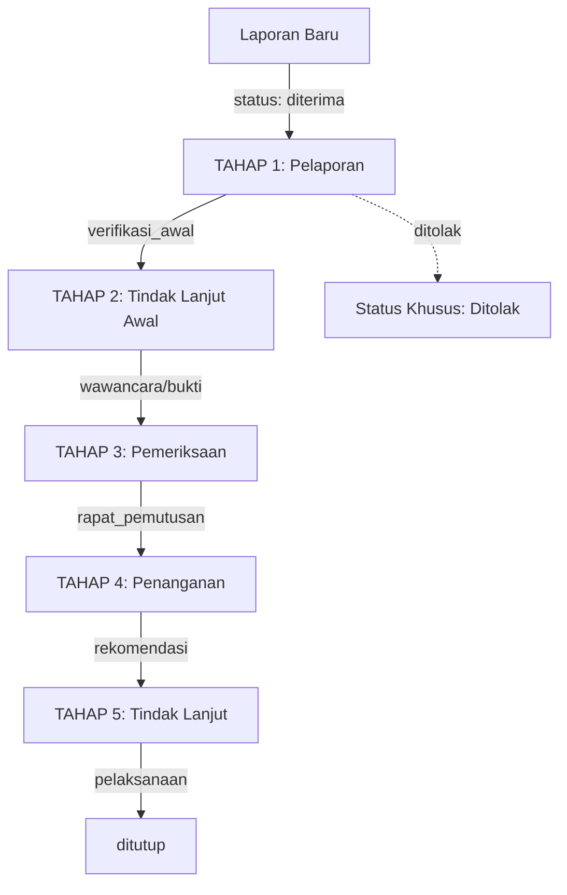

# 📊 Sistem Tracking Status Laporan - PPKPT

## 🎯 Overview
Sistem tracking ini dirancang untuk **menggabungkan 5 tahapan resmi PPKPT** dengan **status detail yang informatif** untuk user, sehingga:
- ✅ Sesuai dengan SOP resmi kampus (compliance)
- ✅ User tetap paham progres detail (transparency)
- ✅ Mudah dipahami admin dan satgas (scalability)
- ✅ Tidak menimbulkan masalah regulasi

---

## 📋 Struktur Tracking 2-Level

### Level 1: **Tahapan Resmi PPKPT** (5 Tahap Besar)

| No | Tahap Resmi | Deskripsi |
|----|-------------|-----------|
| 1️⃣ | **Pelaporan** | Penerimaan dan verifikasi awal laporan |
| 2️⃣ | **Tindak Lanjut Awal** | Wawancara pelapor dan pengumpulan bukti awal |
| 3️⃣ | **Pemeriksaan** | Investigasi mendalam: wawancara terlapor, analisis bukti, rapat |
| 4️⃣ | **Penanganan** | Penentuan rekomendasi tindak lanjut |
| 5️⃣ | **Tindak Lanjut** | Pelaksanaan sanksi/tindakan dan penutupan kasus |

### Level 2: **Sub-Status Detail** (11 Status)

Setiap tahap resmi memiliki sub-status yang lebih detail:

#### 1️⃣ **TAHAP 1: PELAPORAN**
- 🔵 **Laporan Diterima** (`diterima`)
  - Laporan tercatat dalam sistem
- ⏳ **Verifikasi Awal** (`verifikasi_awal`)
  - Tim PPKPT melakukan verifikasi kelengkapan dan validitas laporan

#### 2️⃣ **TAHAP 2: TINDAK LANJUT AWAL**
- 🗣️ **Wawancara Pelapor** (`wawancara_pelapor`)
  - Konfirmasi detail dengan pelapor (opsional jika anonim)
- 📁 **Pengumpulan Bukti Tambahan** (`pengumpulan_bukti`)
  - Mengumpulkan evidence pendukung

#### 3️⃣ **TAHAP 3: PEMERIKSAAN**
- ⏳ **Wawancara Terlapor** (`wawancara_terlapor`)
  - Klarifikasi dengan pihak terlapor
- 🔍 **Pemeriksaan Kronologi & Analisis Bukti** (`analisis_kronologi`)
  - Analisis mendalam terhadap kronologi dan bukti
- 🧩 **Rapat Pemutusan Kasus** (`rapat_pemutusan`)
  - Tim PPKPT memutuskan langkah selanjutnya

#### 4️⃣ **TAHAP 4: PENANGANAN**
- 📌 **Rekomendasi Tindak Lanjut** (`rekomendasi`)
  - Hasil keputusan rapat: sanksi/tindakan yang direkomendasikan

#### 5️⃣ **TAHAP 5: TINDAK LANJUT**
- 🚀 **Pelaksanaan Tindak Lanjut** (`pelaksanaan`)
  - Eksekusi rekomendasi yang telah diputuskan
- ✔ **Kasus Ditutup** (`ditutup`)
  - Kasus selesai dan ditutup

#### ⚠️ **STATUS KHUSUS**
- ❌ **Ditolak** (`ditolak`)
  - Laporan tidak memenuhi syarat atau ditolak

---

## 🔧 Implementasi Teknis

### 1. Model: `Laporan`

```python
class Laporan(models.Model):
    # Status Choices dengan emoji
    STATUS_CHOICES = [
        ('diterima', '🔵 Laporan Diterima'),
        ('verifikasi_awal', '⏳ Verifikasi Awal'),
        # ... (11 status total)
    ]
    
    # Mapping status ke tahap resmi (1-5)
    TAHAP_MAPPING = {
        'diterima': 1,
        'verifikasi_awal': 1,
        'wawancara_pelapor': 2,
        # ...
    }
    
    # Label tahapan resmi
    TAHAP_LABELS = {
        1: 'Pelaporan',
        2: 'Tindak Lanjut Awal',
        # ...
    }
    
    # Helper methods
    def get_tahap_resmi(self):
        """Mengembalikan nomor tahap (1-5)"""
        return self.TAHAP_MAPPING.get(self.status, 0)
    
    def get_tahap_label(self):
        """Mengembalikan label tahap"""
        tahap = self.get_tahap_resmi()
        return self.TAHAP_LABELS.get(tahap, '')
```

### 2. Template: `status_laporan.html`

**Struktur Visual:**
```
┌─────────────────────────────────────┐
│ 📊 Status Laporan                   │
│ ID: RPT-20251205-0007               │
│ Dibuat: 2025-12-05                  │
│ 🔒 Laporan Anonim                   │
└─────────────────────────────────────┘

┌─────────────────────────────────────┐
│ [1] PELAPORAN                       │ ← Tahap Resmi (Level 1)
├─────────────────────────────────────┤
│ ● 🔵 Laporan Diterima              │ ← Sub-status (Level 2)
│   2025-12-05 10:30                  │
│                                     │
│ ● ⏳ Verifikasi Awal               │
│   Menunggu tim                      │
└─────────────────────────────────────┘

┌─────────────────────────────────────┐
│ [2] TINDAK LANJUT AWAL             │
├─────────────────────────────────────┤
│ ○ 🗣️ Wawancara Pelapor            │ ← Inactive status
│   [Pelapor anonim - opsional]      │
└─────────────────────────────────────┘
```

### 3. Views Integration

```python
# views.py - status_laporan_view
laporan = {
    'kode': db_laporan.kode,
    'status': db_laporan.status,
    'tahap_resmi': db_laporan.get_tahap_resmi(),  # 1-5
    'tahap_label': db_laporan.get_tahap_label(),  # "Pelaporan"
    # ... mapping tanggal & catatan dari Progress
}
```

---

## 📱 User Interface

### 1. **Riwayat Laporan**
Menampilkan:
- Status detail dengan emoji
- Tahap resmi: "Tahap 2: Tindak Lanjut Awal"

### 2. **Status Laporan (Detail Tracking)**
Timeline bertingkat:
- **Header tahap** dengan gradient warna (aktif/inactive)
- **Sub-status** dengan bullet points (active/completed/inactive)
- **Note boxes** untuk catatan dari admin
- **Riwayat progress** di bagian bawah

### 3. **Admin Dashboard**
Dropdown edit status dengan `<optgroup>`:
```html
<select name="status">
  <optgroup label="📋 Tahap 1: Pelaporan">
    <option value="diterima">🔵 Laporan Diterima</option>
    <option value="verifikasi_awal">⏳ Verifikasi Awal</option>
  </optgroup>
  <optgroup label="🔄 Tahap 2: Tindak Lanjut Awal">
    ...
  </optgroup>
</select>
```

---

## 🎨 Design System

### Color Coding
- **Tahap Header Aktif**: Gradient purple (#4F46E5 → #7C3AED)
- **Tahap Header Inactive**: Gradient gray (#9CA3AF → #6B7280)
- **Bullet Active**: Purple (#4F46E5) dengan glow effect
- **Bullet Completed**: Green (#10B981)
- **Bullet Inactive**: Gray (#D1D5DB)

### Status Icons
| Emoji | Arti | Context |
|-------|------|---------|
| 🔵 | Diterima | Laporan baru masuk |
| ⏳ | Sedang proses | Menunggu tindakan |
| 🗣️ | Wawancara | Interview/konfirmasi |
| 📁 | Pengumpulan | Collecting evidence |
| 🔍 | Investigasi | Analisis mendalam |
| 🧩 | Rapat | Meeting/decision |
| 📌 | Rekomendasi | Hasil keputusan |
| 🚀 | Pelaksanaan | Executing action |
| ✔ | Selesai | Kasus ditutup |
| ❌ | Ditolak | Tidak valid |

---

## 📊 Data Flow



---

## ✅ Benefits

### 1. **Untuk User**
- Tahu posisi laporan di tahap mana (1-5)
- Detail progres yang jelas (11 sub-status)
- Transparansi penuh tentang proses

### 2. **Untuk Admin**
- Dropdown terstruktur per tahap
- Mudah update status sesuai SOP
- Visual yang jelas di kelola laporan

### 3. **Untuk Institusi**
- Compliance dengan PPKPT resmi
- Audit trail lengkap via `Progress` model
- Scalable untuk satgas nantinya

---

## 🚀 Migration

File: `users/migrations/0020_update_status_choices_ppkpt.py`

Menambahkan:
- Status baru: `analisis_kronologi`
- Update labels dengan emoji
- Tidak break existing data

---

## 📝 Notes

1. **Laporan Anonim**: Wawancara pelapor ditandai sebagai "opsional"
2. **Progress Model**: Setiap perubahan status tercatat dengan catatan
3. **Backward Compatible**: Status lama (`diterima`, `verifikasi_awal`, dll) tetap valid
4. **Future-proof**: Mudah menambah sub-status baru dalam tahap yang ada

---

## 🔗 Related Files

- `users/models.py`: Model definition + helper methods
- `users/views.py`: `status_laporan_view()` + mapping logic
- `templates/menu_users/status_laporan.html`: Timeline UI
- `templates/menu_users/riwayat_laporan.html`: List view
- `templates/dashboard/kelola_laporan.html`: Admin view
- `templates/dashboard/edit_laporan.html`: Status dropdown

---

**Last Updated**: December 6, 2025  
**Migration**: 0020_update_status_choices_ppkpt
