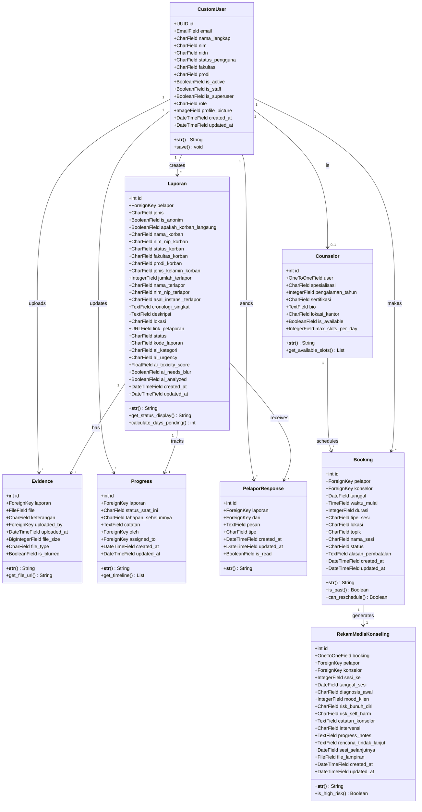
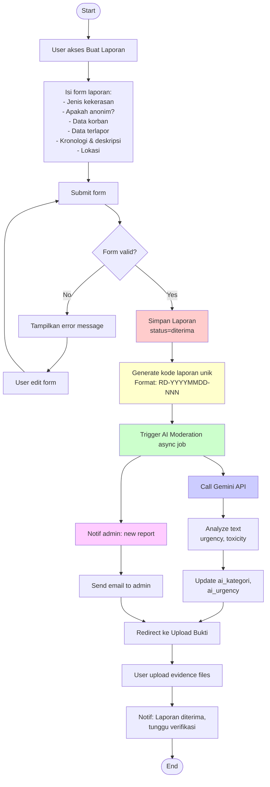
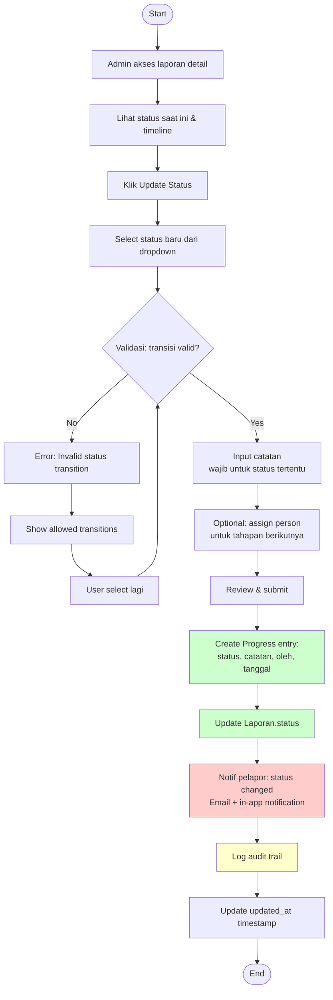
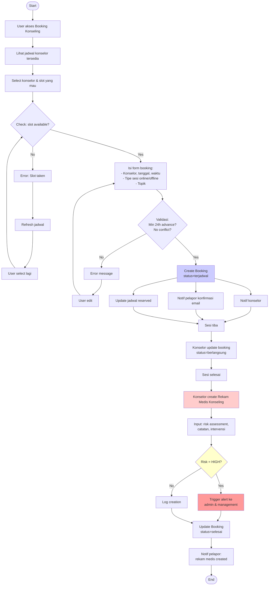
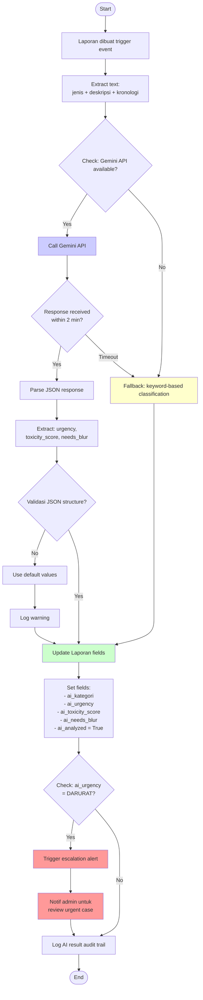
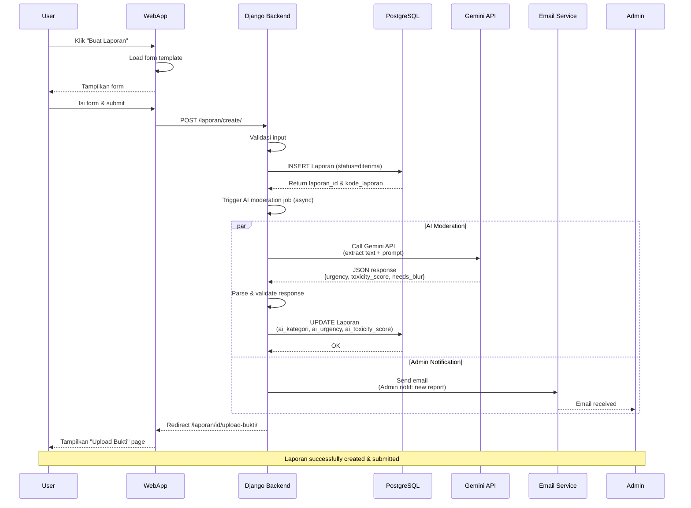
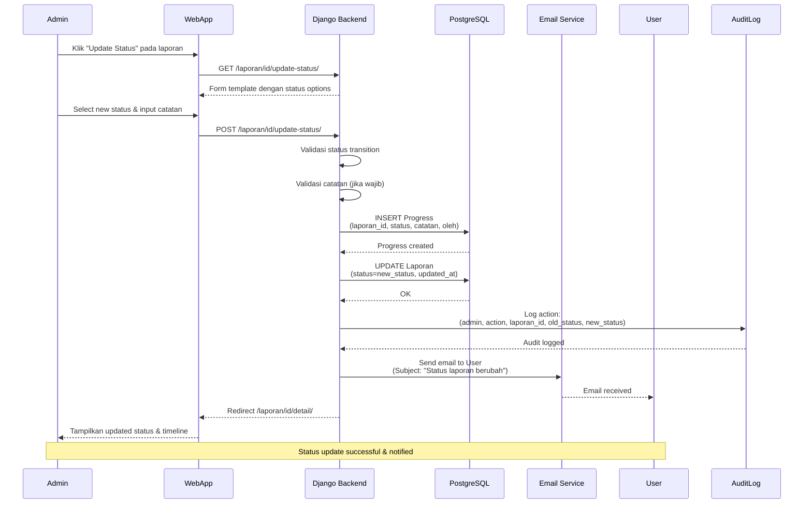
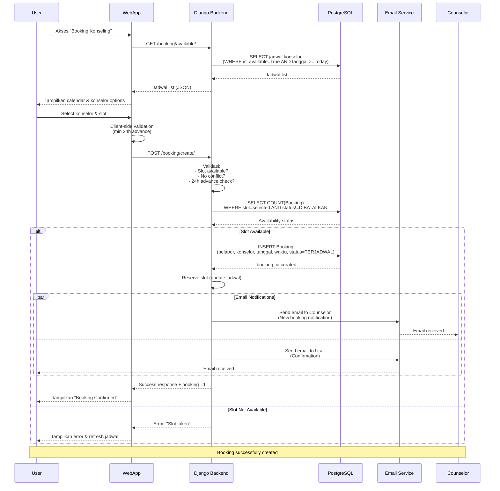
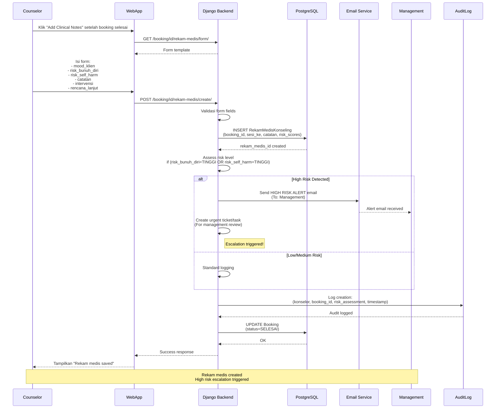
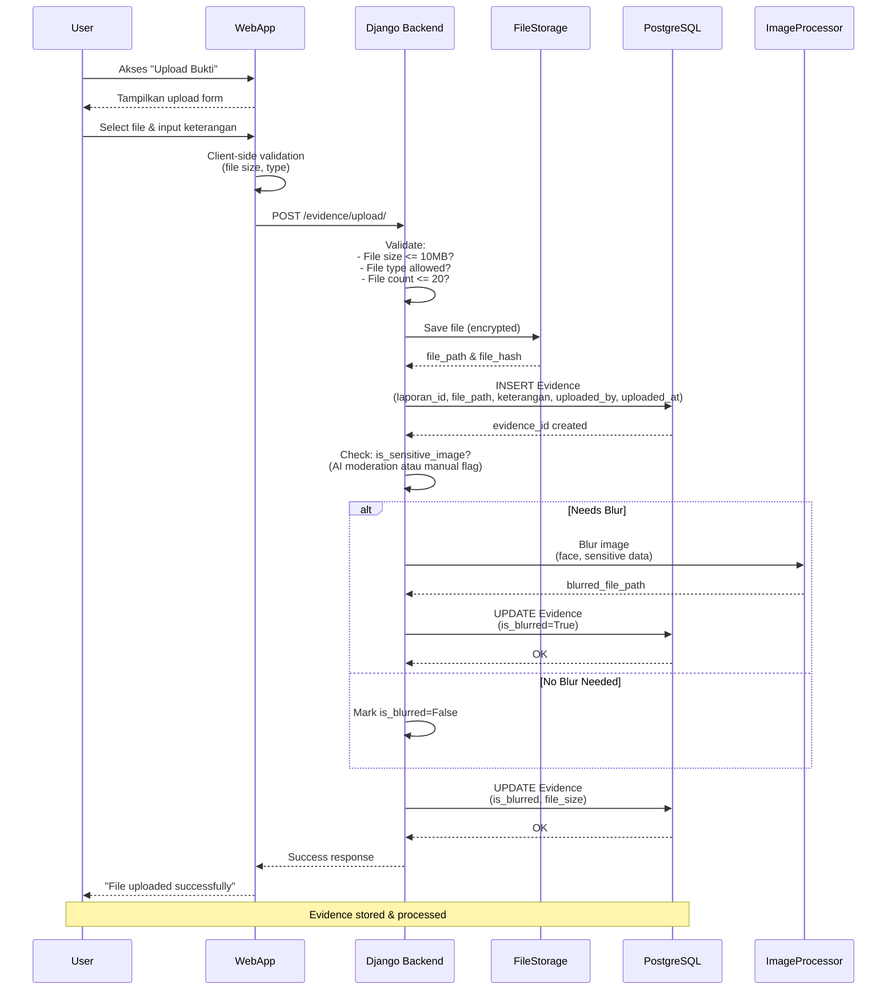

# System Design Diagrams
## 3.4.3 - 3.4.5 Class, Activity & Sequence Diagrams

**Ruang Dengar Platform**  
**Version**: 1.0  
**Last Updated**: December 15, 2025

---

## 📋 Table of Contents

1. [3.4.3 Class Diagram](#343-class-diagram)
2. [3.4.4 Activity Diagram](#344-activity-diagram)
3. [3.4.5 Sequence Diagram](#345-sequence-diagram)

---

## 3.4.3 Class Diagram

### Overview
Class Diagram menunjukkan struktur Django models dan relationships antar entitas dalam Ruang Dengar Platform.

### Mermaid Class Diagram



### Key Relationships

| Relationship | Type | Description |
|---|---|---|
| CustomUser → Laporan | 1:N | User sebagai pelapor dapat membuat banyak laporan |
| Laporan → Evidence | 1:N | Satu laporan dapat memiliki banyak bukti/file |
| Laporan → Progress | 1:1 | Satu laporan memiliki satu timeline progress |
| Laporan → PelaporResponse | 1:N | Satu laporan dapat memiliki banyak pesan/komunikasi |
| Counselor → Booking | 1:N | Satu konselor dapat memiliki banyak booking |
| CustomUser → Booking | 1:N | Satu user dapat membuat banyak booking |
| Booking → RekamMedisKonseling | 1:1 | Satu booking menghasilkan satu rekam medis |

---

## 3.4.4 Activity Diagram

### Overview
Activity Diagram menggambarkan alur proses (workflow) untuk fitur-fitur utama sistem.

### AD-001: Laporan Creation Workflow



### AD-002: Status Update & Case Management Workflow



### AD-003: Booking & Konseling Workflow



### AD-004: AI Moderation Workflow



---

## 3.4.5 Sequence Diagram

### Overview
Sequence Diagram menunjukkan interaksi antar komponen sistem dalam urutan waktu.

### SD-001: Laporan Creation Sequence



### SD-002: Status Update Sequence



### SD-003: Booking Sequence



### SD-004: Rekam Medis Creation Sequence (High Risk Alert)



### SD-005: Evidence Upload & Blur Sequence



---

## Diagram Legend

### Activity Diagram Symbols
- **Oval**: Start/End
- **Rectangle**: Activity/Action
- **Diamond**: Decision point (if/then/else)
- **Arrow**: Flow direction
- **Fork/Join**: Parallel activities
- **Note**: Additional information

### Sequence Diagram Symbols
- **Actor**: External user/system
- **Participant**: Component/service
- **Arrow**: Synchronous message (→)
- **Dashed Arrow**: Return message (-->)
- **Alt/Loop**: Conditional/loop behavior
- **Note**: Additional context

### Color Coding
- **Red**: Create/Insert operations
- **Green**: Update operations
- **Blue**: Retrieve/Query operations
- **Yellow**: External API calls
- **Purple**: Validation & business logic

---

## Key Workflow States

### Laporan Status States
```
diterima 
  ↓ (admin verify)
verifikasi_awal 
  ↓ (schedule interview)
wawancara_pelapor 
  ↓ (collect evidence)
pengumpulan_bukti 
  ↓ (interview subject)
wawancara_terlapor 
  ↓ (analyze)
analisis_kronologi 
  ↓ (internal meeting)
rapat_pemutusan 
  ↓ (generate recommendation)
rekomendasi 
  ↓ (implement action)
pelaksanaan 
  ↓ (case closed)
ditutup
```

### Booking Status States
```
TERJADWAL 
  ↓ (session starts)
BERLANGSUNG 
  ↓ (session ends)
SELESAI 
  ↓ OR (user cancels 24h+)
DIBATALKAN
```

### Rekam Medis Risk Levels
```
TINGGI (High Risk)
  → Immediate escalation to management
  → Email alert
  → Urgent review task created

SEDANG (Medium Risk)
  → Logged for monitoring
  → Standard follow-up

RENDAH (Low Risk)
  → Normal case handling
```

---

## Integration Points

### External Systems
1. **Gemini API**: AI moderation for content analysis
2. **Email Service**: SMTP untuk notifikasi & komunikasi
3. **File Storage**: S3/Local untuk evidence & lampiran
4. **Microsoft Entra ID**: SSO authentication (oauth2)
5. **Database**: PostgreSQL untuk persistent storage

### Async Jobs (Celery/APScheduler)
- AI moderation (laporan create)
- Bulk email notifications
- Data backup & archival
- Report generation

---

**Document Version**: 1.0  
**Last Updated**: December 15, 2025  
**Diagrams Format**: PlantUML & Mermaid (both supported in VS Code)  
**Next Review**: January 2025 (after MVP launch)
